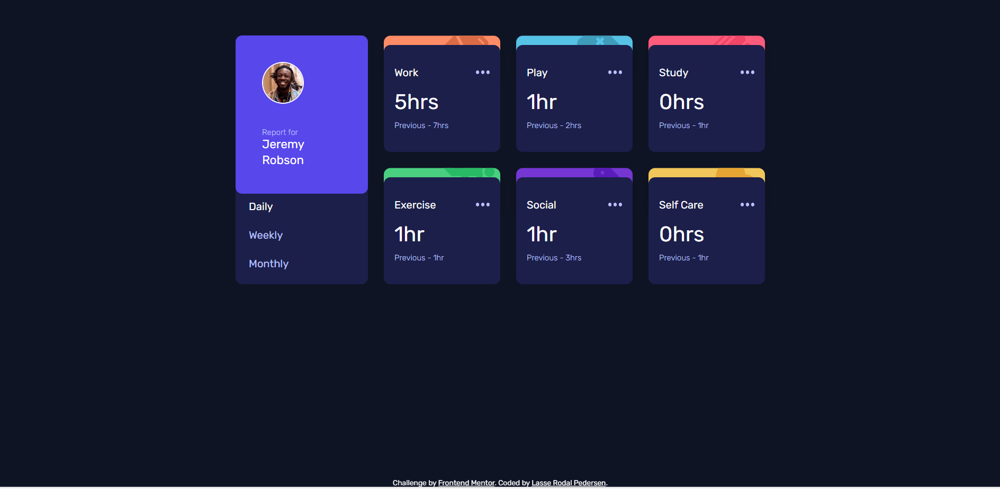
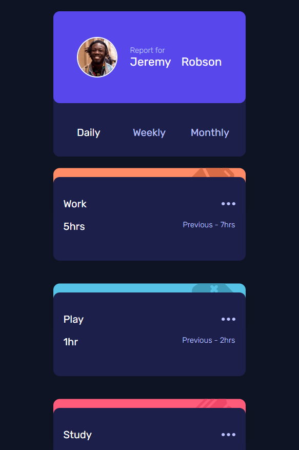
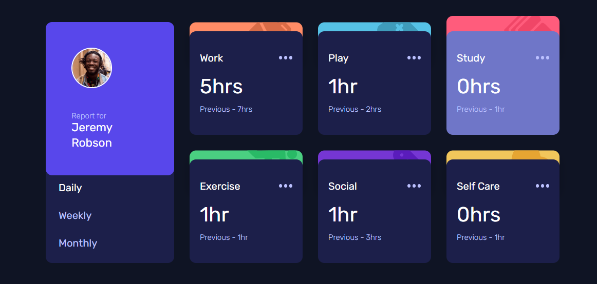

# Frontend Mentor - Time tracking dashboard solution

This is a solution to the [Time tracking dashboard challenge on Frontend Mentor](https://www.frontendmentor.io/challenges/time-tracking-dashboard-UIQ7167Jw). Frontend Mentor challenges help you improve your coding skills by building realistic projects. 

## Table of contents

- [Overview](#overview)
  - [The challenge](#the-challenge)
  - [Screenshot](#screenshot)
  - [Links](#links)
- [My process](#my-process)
  - [Built with](#built-with)
  - [What I learned](#what-i-learned)
- [Author](#author)

## Overview

### The challenge

Users should be able to:

- View the optimal layout for the site depending on their device's screen size
- See hover states for all interactive elements on the page
- Switch between viewing Daily, Weekly, and Monthly stats

### Screenshot

  
Desktop version

  

  
Mobile version

  

  
Active version

  

### Links

- [Solution URL:](https://github.com/Lasse-Rodal/Time-Tracking-Dashboard)
- [Live Site URL:](https://lasse-rodal.github.io/Time-Tracking-Dashboard/)

## My process

### Built with

HTML:
- Semantic elements and structured layout
- Buttons for user interaction
- Fetching data from an external JSON file

CSS:
- CSS Custom Properties
- Flexbox
- Grid Layout
- Media Queries
- Button States
- Card Hover Effects

JavaScript:
- Fetch API
- DOM Manipulation
- Event Listeners

### What I learned

I learned how to build a dynamic and interactive dashboard using HTML, CSS, and JavaScript, including techniques like fetch API for data fetching, CSS Grid, and Flexbox for layout, and creating responsive designs with mobile-first practices.

## Author

- Github - [Lasse Rodal Pedersen](https://github.com/Lasse-Rodal)
